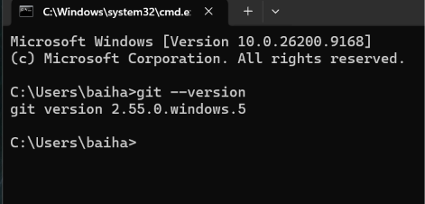
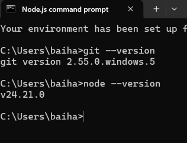

# **Praktikum Mentiapkan Memulai Pemrograman Mobile dengan React Native**
## **Tujuan Pembelajaran**
Setelah menyelesaikan modul praktikum ini, mahasiswa diharapkan mampu:
- Menginstal Git dan Github
- Menginstal Node.js dan NPM
- Menginstal Expo CLI
- Membuat project React Native
- Menjalankan React Native

1. Install Git di Local
    - unduh dan instal Git Via : https://git-scm.com/install/windows
    - Verifikasi Git  (buka cmd dan ketik "git --version")
    

2. Install Node.js
    - unduh dan instal Node.js Via : https://nodejs.org/en/download
    - verifikasi Git (buka cmd dan ketik "node --version")
    

3. Memulai Projek dengan Framework Expo
    - buka terminal pada code editor
    - pastikan aktif di directory yang dituju
    - ketikan (npm create-expo-app ptmn2 --template blank)
    - tunggu hingga proses install selesai
    - projek selesai

4. Menjalankan Projek React Native
    - masuk ke directory projek  (cd ptmn2)
    - jalankan projek (npx expo start)
    - scan QR code dengan aplikasi Expo Go
    - jika ingin run emulator di WEB ketik w
    - di terminal "npx expo install  react-dom react-native-web"

5. Latihan pertemuan 2
    - tambahkan text berupa:
    - nama lengkap
    - tempat tanggal lahir
    - cita cita
    - rencana hidup