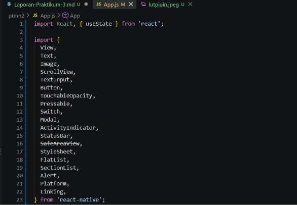
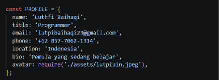
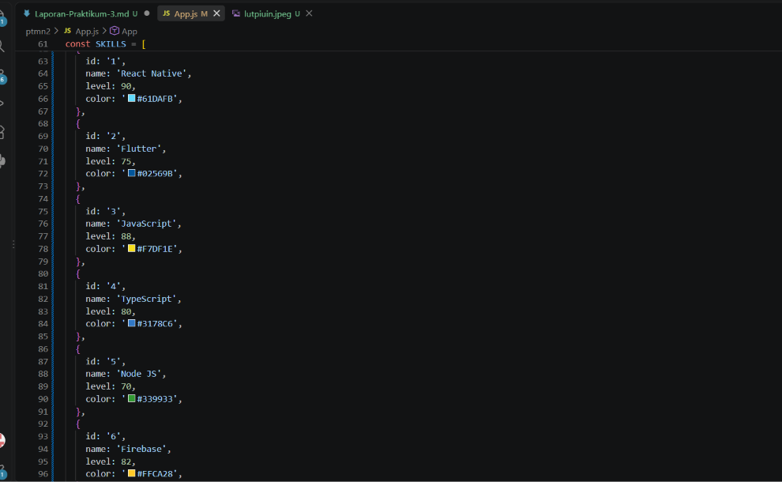
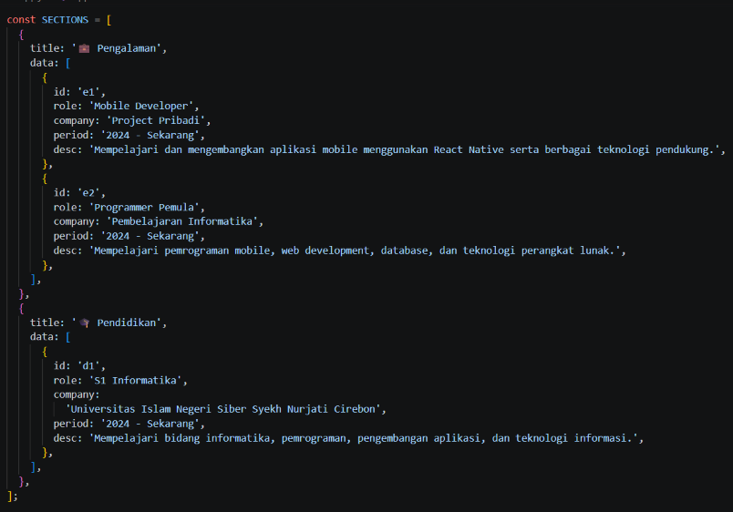
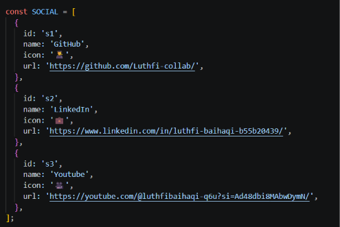
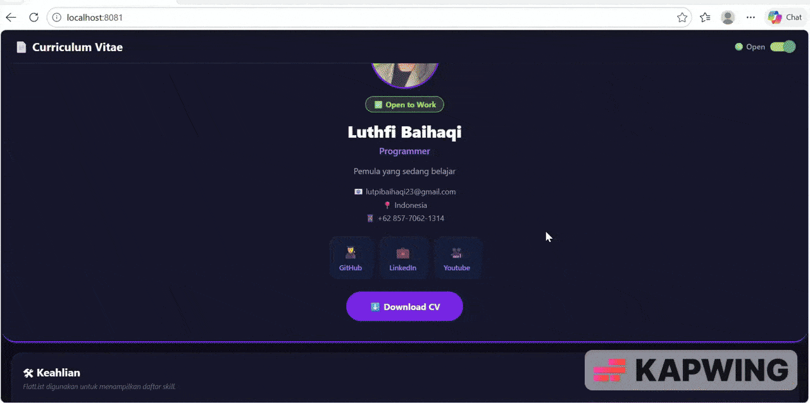

# Laporan Praktikum Pemrograman Mobile Pertemuan 3 #
## Tujuan Pembelajaran 

Setelah menyelesaikan praktikum ini, mahasiswa mampu:

1. Memahami dan menggunakan **16 Core Components** React Native
2. Menerapkan **StyleSheet** untuk styling terpusat
3. Menggunakan **useState** untuk state management dasar
4. Membuat layout yang responsif dengan **Flexbox**
5. Menangani **interaksi pengguna** (tekan, input, scroll)

Langkah 1: Mengimpor  Components

1. Buka file App.js pada folder projek ptmn2
2. Import 16 core components sebagai berikut:
3. Konfirmasi bukti

Langkah 2: Menyiapkan data Objek dan Array
1. Membuat objek untuk menyimpan data Profile
2. Buat Objek Array bernama PROFILE
3. Konfirmasi bukti

4. Membuat Objek Array SKILSS untuk menyimpan data skills
5. Buat Objek Array bernama SKILLSS
6. konfirmasi bukti

7. Membuat objek Array SECTIONS untuk menyimpan Riwayat Pekerjaan
8. Membuat objek Array SOCIAL untuk menyimpan Media Sosial
9. Konfirmasi bukti SECTIONS

10. Konfirmasi bukti SOCIAL

